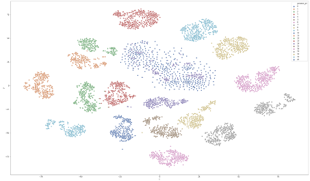

# Predicting cancer from circulating microRNAs

Liquid Biopsy: Using DNA in Blood to Detect, Track, and Treat Cancer

In this project, we present the full pipeline of steps to creating a predictive model of cancer from circulating microRNAs.  The data is an amalgamation of 21 datasets, all using circulating microRNAs to predict cancer in humans. Different models are trained for each 21 problem and tuned. The final model was in the top 10 Kaggle leaderboard with 73% average accuracy.

Circulating microRNAs are small, non-coding RNAs found in gene regulatory networks that are growing popular as biomarkers for human disease. The data is an aggregation of 21 datasets, each using microRNA profiles to predict some form of cancer. Two example contributors are from Sudo, et al., 2019 [add hyperlink https://pubmed.ncbi.nlm.nih.gov/31125107/] and Yokoi, et al., 2018 [add hyperlink https://www.nature.com/articles/s41467-018-06434-4] . The aggregate dataset has been pre-cleaned and ranked to contain 977 uniform features representing microRNA expression levels, and targets from 21 different datasets (some binary, some multiclass) representing some cancer diagnosis. 

Data preprocessing, experimentation, and the final model are all shown in notebook_name.ipynb.

Methods include:

1. Sklearn classifiers 
    * Random Forest Classifier
    * HistGradientBoostingClassifier
    * XGBoost Classifier
2. Custom neural networks using Pytorch
    * One layer with Batchnorm, weight_decay and dropout for regularization

This project is for MSDS630 - Advanced Machine Learning, in partial fulfillment of the MS in Data Science degree at the University of San Francisco.

Contributors: Emre Okcular, Lucia Page-Harley

### Visualization of each problem by TSNE

